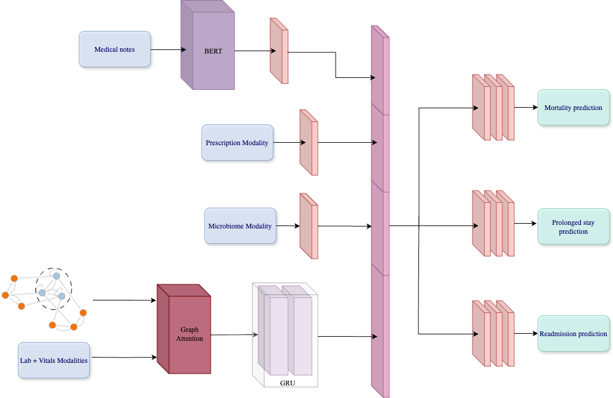

# CONTACT: Contextual and Temporal attention based framework for predicting clinical Trajectory



## Overview

This repository contains a comprehensive machine learning system for predicting critical healthcare outcomes in ICU patients using multi-modal data. The system combines Graph Neural Networks (GNNs) with Gated Recurrent Units (GRUs) to process temporal clinical data, patient notes, biosignals, and prescription information for mortality, prolonged length of stay, and readmission prediction.

## Key Features

- **Multi-Modal Architecture**: Integrates temporal clinical data, clinical notes, biosignals, and prescription data
- **Graph Neural Networks**: Uses Graph Attention Networks (GAT) to model patient relationships
- **Temporal Modeling**: Employs GRU layers for sequential data processing
- **Multi-Task Learning**: Simultaneously predicts mortality, prolonged stay, and readmission
- **Calibration**: Includes prediction calibration for reliable probability estimates
- **Ablation Studies**: Comprehensive analysis of different modality contributions

## Model Architecture

The `GraphGRUMortalityModel` combines several key components:

1. **Graph Attention Layers**: Process patient relationships using TransformerConv layers
2. **GRU Layers**: Handle temporal sequences of clinical measurements
3. **Multi-Modal Fusion**: Integrates:
   - Clinical time series data (vitals, lab values)
   - Clinical notes (using pre-trained embeddings)
   - Biosignals (binary features)
   - Prescription data (embedding bag representation)
4. **Multi-Task Classifiers**: Separate prediction heads for each outcome

## Dataset

The model is trained on MIMIC-IV data with the following preprocessing:

- **Patient Selection**: First admissions, age 18-89, minimum 24h stay
- **Temporal Resolution**: 4-hour prediction windows
- **Targets**: 30-day mortality, prolonged stay (>7 days), 30-day readmission

## Installation

### Prerequisites

- Python 3.10
- CUDA-compatible GPU (recommended)
- Access to MIMIC-III database

```

## Usage

### Environment Setup

Before running the code, set up your Python environment:

- **If running on Google Colab:**
  1. Install PyTorch Geometric (and dependencies) with:
     ```python
     !pip install torch-geometric==2.6.1
     ```
- **If running locally:**
  1. (Recommended) Create a new environment using the provided `environment.yml` file:
     ```bash
     conda env create -f environment.yml
     conda activate <env_name>
     ```
     Replace `<env_name>` with the name specified in the `environment.yml` file.
  2. Alternatively, install all dependencies from `requirements.txt`:
     ```bash
     pip install -r requirements.txt
     ```

Make sure you have access to the MIMIC-III/IV data and have set up any required environment variables or database connections as described in the project documentation.


For training and evaluating the model, use the `Project_Evaluation.ipynb` notebook:

This notebook contains:
- Complete data preprocessing pipeline
- Model training with hyperparameter optimization
- Comprehensive evaluation on test data
- Performance analysis and visualization

### Inference on New Data

For inference on new patient datasets, use the `unseen_data_evaluation.py` script:

```python
from unseen_data_evaluation import evaluate_unseen_data

# Evaluate on new patient data
results = run_pipeline_on_unseen_data(subject_ids ,con)
```

This script handles:
- Loading pre-trained models
- Preprocessing new patient data
- Generating predictions for mortality, prolonged stay, and readmission
- Outputting calibrated probability estimates

## Key Files

- `Model.py`: Main model architecture implementation
- `preprocess.py`: Data preprocessing pipeline
- `Dataset.py`: PyTorch dataset classes
- `unseen_data_evaluation.py`: Evaluation on new patient data
- `NoteEmbedder.py`: Clinical note embedding generation
- `Project_Evaluation.ipynb`: Model evaluation and analysis


## Calibration

The model includes prediction calibration using logistic regression to ensure reliable probability estimates for clinical decision-making.
The calibration process can also be demonstrated and visualized within the `Project_Evaluation.ipynb` notebook, allowing users to observe calibration curves and assess the reliability of predicted probabilities alongside other model evaluation metrics.


## Contact

For questions or collaborations, please contact [Ronsheinin@mail.tau.ac.il, kupershmit@mail.tau.ac.il].

---

**Note**: This model is for research purposes only and should not be used for direct clinical decision-making without proper validation and regulatory approval.
